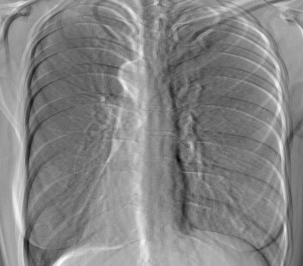

# Translatory Rigid Registration of Dual-Energy Radiography Images

Registration, as a process that compares an image to a reference image with the goal of finding a geometrical transformation that establishes good spatial correspondence between them, presents an important beginning step for subsequent image processing operations or deformable registration. By itself, it also plays an important role in diagnostics and therapeutics in medicine, accelerating efficiency and efficacy of treatment. Information coming from numerous medical imaging modalities is large in size and it is of vital importance that this information is accurately integrated. Rigid registration has been shown to be a significant tool for the integration of this information, as well as an important tool in the domain of mathematical and statistical model formation.

The methodology applied in this project is summarized as follows. Region-of-interest (ROI) is extracted and statistics of the local image regions are normalized using z-transformation. A multiresolution approach is applied and images of lower resolution are used for further efficient optimization. Optimization algorithms such as gradient descent and nonlinear conjugate-gradient descent (Polak-Ribiere) have been implemented for finding the optimal translation parameters. For step optimization, golden section search has been implemented. The multiresolution approach solution has been implemented in MATLAB R2015a, while the open-source solution has been implemented in C++, according to the C++14 standard. OpenCV 4.5.2, a cross-platform, open-source library has been used for efficient image processing in the C++ implementation.

Using the presented methodology, with the appropriate selection of z-normalization parameters, it is possible to obtain translation parameters close to optimal, along with a significant efficiency boost. The multiresolution approach had turned out to be an important aspect of the presented solution architecture for translatory rigid registration, resulting in ≈60 times faster registration execution for gradient descent and ≈66 times faster registration execution for nonlinear conjugate-gradient descent.

<table>
  <tr>
    <td><b>Before Registration</b></td>
    <td><b>After Registration</b></td>
    <td><b>Convergence Rate</b></td>
  </tr>
  <tr>
    <td></td>
    <td></td>
    <td></td>
  </tr>
</table>
